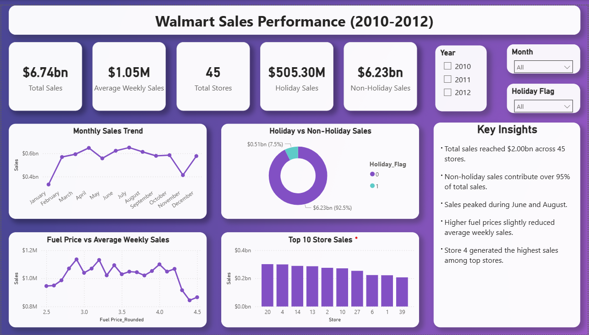

# 📊 Walmart Retail Sales Business Analytics Project

## 📌 Project Overview

This project analyzes Walmart retail sales data using Python, Power BI, and Business Analytics techniques to uncover insights related to sales trends, store performance, seasonal demand, and economic impact on sales.

The project includes:

- Data Cleaning & Preprocessing
- Exploratory Data Analysis (EDA)
- Correlation Analysis
- Outlier Detection
- Time Series Trend Analysis
- Business Insights & Recommendations
- Interactive Power BI Dashboard

---

## 🛠️ Tools Used

- Python
- Pandas
- NumPy
- Matplotlib
- Seaborn
- Power BI
- Jupyter Notebook
- VS Code
- Microsoft Excel

---

## 📂 Project Structure

```bash
walmart_retail_sales_business_analytics_project/
│
├── data/
│   └── Walmart.xlsx
│
├── exports/
│   └── walmart_cleaned.xlsx
│
├── notebooks/
│   └── walmart_analysis.ipynb
│
├── powerbi/
│   └── walmart_sales_dashboard.pbix
│
├── reports/
│   ├── walmart_sales_dashboard.pdf
│   └── walmart_sales_performance_dashboard.png
│
├── visuals/
│   ├── box_plot_sales.png
│   ├── correlation_heatmap.png
│   ├── correlation_map.png
│   ├── cpi_vs_sales.png
│   ├── distribution_of_sales.png
│   ├── fuel_price_vs_sales.png
│   ├── holiday_vs_nonholiday_sales.png
│   ├── monthly_sales_trend.png
│   ├── sales_by_store.png
│   ├── temp_vs_sales.png
│   ├── top10_sales_by_store.png
│   ├── unemployment_vs_sales.png
│   └── yearly_sales_trend.png
│
├── README.md
│
└── venv/
```

---

## 📈 Key Metrics

- Total Records: 6,435
- Total Stores: 45
- Highest Performing Store: Store 20
- Peak Sales Year: 2011
- Holiday Sales Higher than Non-Holiday Sales
- Multiple High Sales Outliers Identified

---

## 🔍 Key Insights

- Holiday weeks generated higher average sales
- Strong seasonal sales fluctuations observed
- Store 20 achieved the highest sales performance
- Economic indicators showed weak direct correlation with sales
- Multiple high-value sales spikes detected
- Monthly sales trends revealed peak business periods

---

## 📊 Dashboard



---

## 📉 Visualizations Included

### 📦 Sales Distribution & Outlier Analysis

- Boxplot of Weekly Sales
- Distribution of Weekly Sales

### 🔥 Correlation & Relationship Analysis

- Correlation Heatmap
- Fuel Price vs Weekly Sales
- Temperature vs Weekly Sales
- CPI vs Weekly Sales
- Unemployment vs Weekly Sales

### 📅 Trend Analysis

- Monthly Sales Trend
- Yearly Sales Trend

### 🏪 Store Performance Analysis

- Average Sales by Store
- Top 10 Walmart Stores by Sales

### 🎉 Holiday Impact Analysis

- Holiday vs Non-Holiday Sales

---

## 💡 Business Recommendations

- Increase inventory during holiday seasons
- Focus more on top-performing stores
- Improve sales forecasting methods
- Optimize promotional campaigns
- Monitor economic indicators regularly
- Strengthen seasonal demand planning

---

## 📁 Files Included

### 📂 Dataset Files

- Walmart.xlsx
- walmart_cleaned.xlsx

### 📒 Notebook Files

- walmart_analysis.ipynb

### 📊 Power BI Files

- walmart_sales_dashboard.pbix

### 📑 Report Files

- walmart_sales_dashboard.pdf
- walmart_sales_performance_dashboard.png

### 📉 Visualization Files

- box_plot_sales.png
- correlation_heatmap.png
- correlation_map.png
- cpi_vs_sales.png
- distribution_of_sales.png
- fuel_price_vs_sales.png
- holiday_vs_nonholiday_sales.png
- monthly_sales_trend.png
- sales_by_store.png
- temp_vs_sales.png
- top10_sales_by_store.png
- unemployment_vs_sales.png
- yearly_sales_trend.png

---

## 🚀 Future Improvements

- Machine Learning Forecasting
- SQL Database Integration
- Cloud Dashboard Deployment
- Real-Time Data Pipeline
- Advanced Predictive Analytics

---

## 📚 Analytical Techniques Used

### ✔️ Data Cleaning

- Handling missing values
- Duplicate removal
- Data type conversion
- Feature engineering

### ✔️ Exploratory Data Analysis (EDA)

- Statistical summaries
- Correlation analysis
- Outlier detection
- Distribution analysis

### ✔️ Business Intelligence

- KPI tracking
- Dashboard storytelling
- Business recommendations
- Trend forecasting

---

## 📌 Power BI Dashboard Features

- KPI Cards
- Interactive Filters & Slicers
- Sales Trend Analysis
- Store Performance Tracking
- Holiday Sales Comparison
- Dynamic Business Insights

---

## 🧠 Business Questions Answered

- Which Walmart store performs the best?
- How do holidays impact sales?
- Which months generate peak sales?
- Do fuel prices affect sales performance?
- Is unemployment related to weekly sales?
- Which stores need performance improvement?

---

## 👨‍💻 Author

Raju Bandham

### 🔗 Connect With Me

- GitHub: https://github.com/BandhamRaju
- LinkedIn: https://www.linkedin.com/feed/update/urn:li:activity:7458584893778939904/
